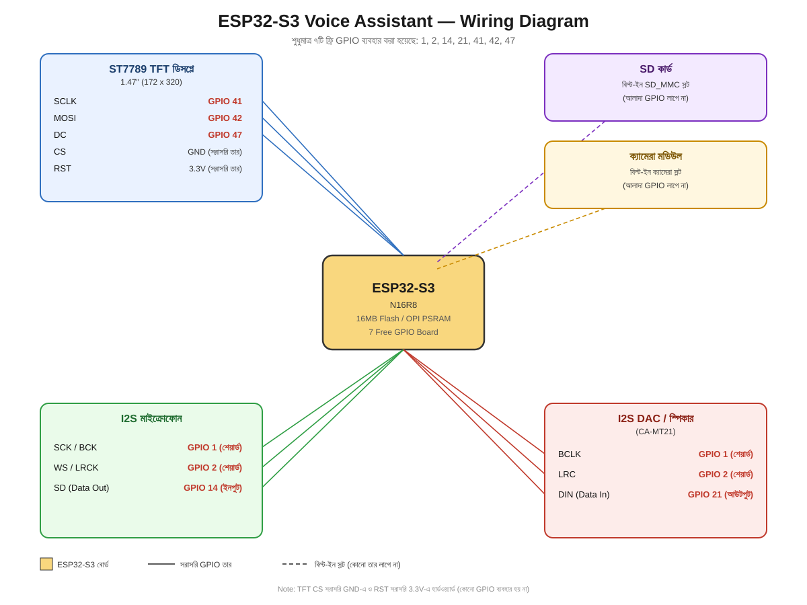

# ESP32-S3-Voice-Assistant

English: This device is essentially a smart AI voice assistant device/robot. Its functions:

It can answer any question asked to it

It contains various information that can serve as a teacher for young children

An important feature: using its built-in camera, it can detect when someone other than a specified/authorized person appears in front of it, and alert us accordingly

Basically, it's an all-in-one robot — fully voice-controlled, operable entirely by speaking

বাংলা: এই ডিভাইসটা মূলত একটা স্মার্ট AI ভয়েস অ্যাসিস্ট্যান্ট ডিভাইস/রোবট। এটার কাজ: এটাতে যে কোনো প্রশ্ন করলে উত্তর দিতে পারবে। এটাতে বিভিন্ন তথ্য রাখা হয়েছে যা ছোট বাচ্চাদের শিক্ষকের কাজ করবে। এছাড়া গুরুত্বপূর্ণ একটা কাজ হলো এটাতে ব্যবহার করা ক্যামেরার মাধ্যমে, নির্দিষ্ট ব্যক্তি বাদে অন্য কেউ এর সামনে এলে এটা বুঝে আমাদের সতর্ক করতে পারবে। মূলত এটা একের ভিতর সব রোবট, যা সম্পূর্ণ voice control, মুখে নিয়ন্ত্রণ করা যাবে।

